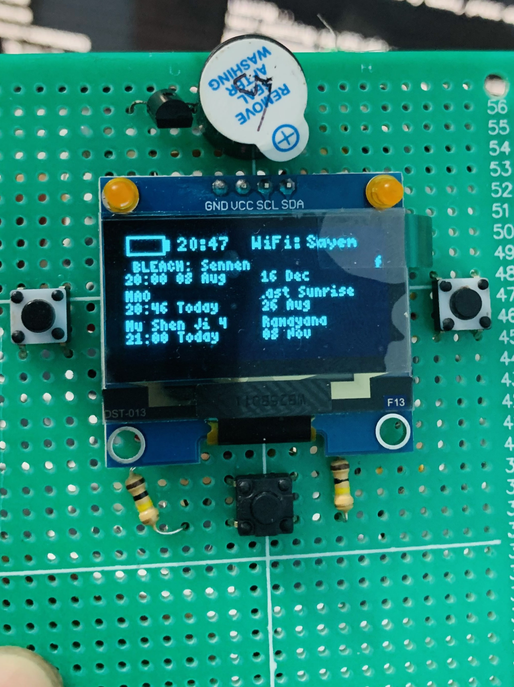
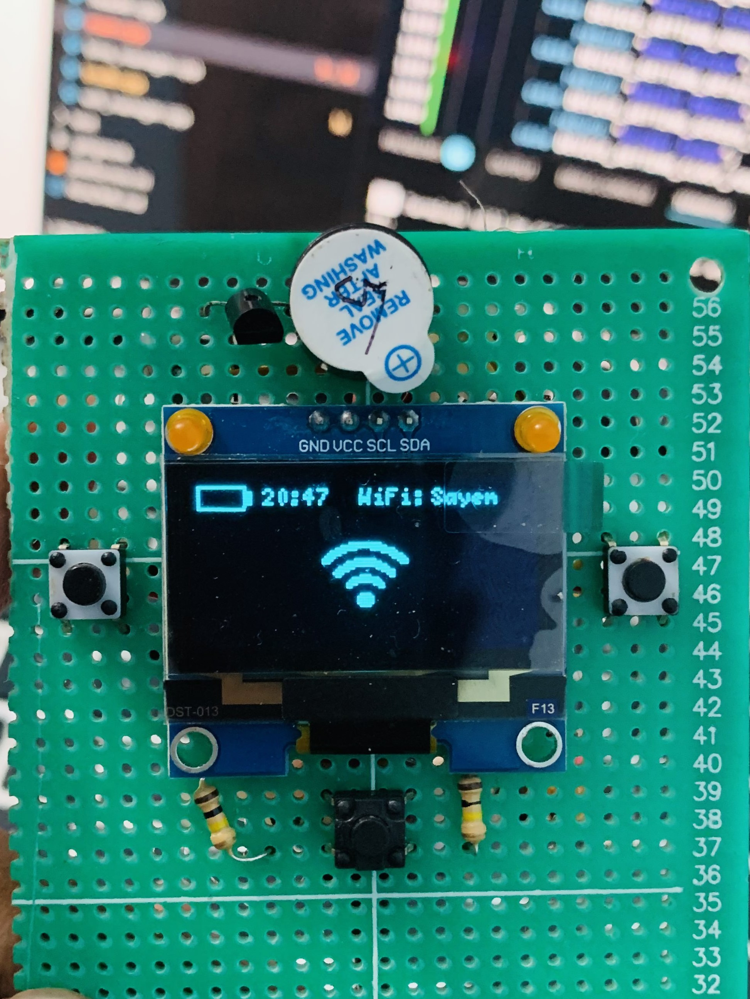
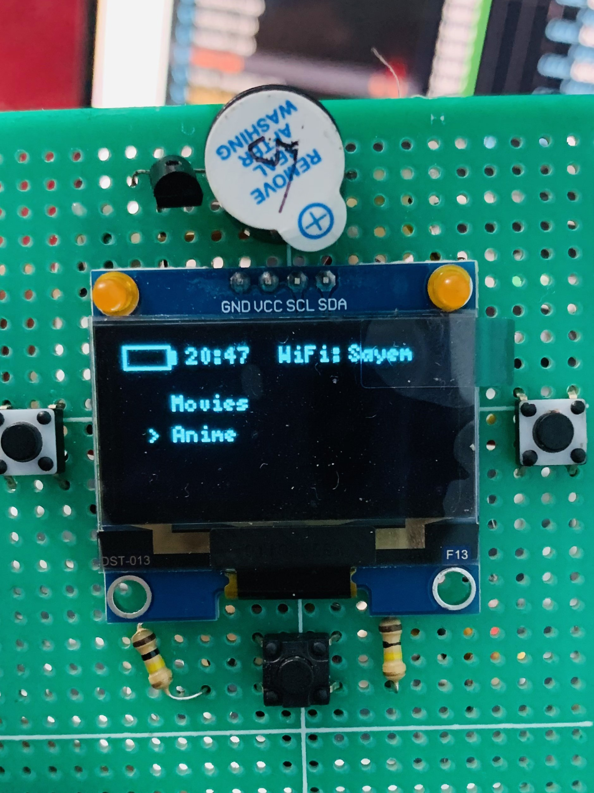

# 📺 AnimeNotifier for ESP32-C3

A compact ESP32-C3 powered anime and movie notifier with a monochrome OLED display, Wi-Fi connectivity, on-device title browsing, configurable alerts, and a three-button interface.

Current firmware release: V1.0.3

### V1.0.3

- Added the operating manual LED behavior guide.
- Kept the firmware version in sync with the current release tag.

The firmware tracks up to 3 anime entries and 3 movie entries on the home screen, supports title detail pages, and refreshes online data on a configurable interval.

---

## ✨ Features

- 📡 Wi-Fi connectivity with automatic reconnect and saved credentials
- 📺 Anime episode tracking from AniList
- 🎬 Upcoming movie tracking from TMDB
- 🏠 Home screen title browsing with a blinking selection cursor
- 📄 Title detail screens with wrapped descriptions and scrolling
- 🔔 Configurable buzzer alerts before airing time
- 💡 Left LED status signaling for loading, errors, and alerts
- 📱 128×64 SH1106 OLED interface
- 🎮 Three-button navigation
- 🔄 Configurable refresh interval: 5, 15, 30, or 60 minutes
- 🌙 Automatic low power mode with selectable battery trigger
- 🔋 Real-time battery level indicator
- 🕒 12-hour or 24-hour clock format
- 💤 Configurable display sleep timeout

---

## 📷 Preview

<p align="center">
    
    
    
</p>

## 🛠 Hardware

### Tested On

- ESP32-C3 SuperMini

### Components

- 128×64 OLED (SH1106 I²C)
- ESP32-C3 SuperMini
- 3 Push Buttons
- 5v Active Buzzer
- Left and right status LEDs
- J1059 module
- 900 mAh battery

### Current Firmware Settings

- Brightness
- LED alerts
- Buzzer alerts
- Low power mode
- Auto low power trigger: 5%, 10%, 15%, or Never
- Buzzer lead time: 2m before, 5m before, 10m before, or on time
- Refresh interval: 5m, 15m, 30m, or 60m
- Home cursor default on boot
- Detail screen auto-return timeout
- Screen sleep timeout
- Clock format: 12-hour or 24-hour
- Description source: full or short summary

---

## 📌 Pin Configuration

| Component | GPIO | Notes |
|-----------|-----:|-------|
| OLED SDA | GPIO8 | SH1106 I²C data |
| OLED SCL | GPIO9 | SH1106 I²C clock |
| OK Button | GPIO6 | Short press/select, long press/back |
| Left Button | GPIO7 | Home cursor / list navigation |
| Right Button | GPIO3 | Home cursor / list navigation |
| Battery ADC | GPIO0 | Battery voltage sensing |
| Buzzer | GPIO21 | Active buzzer output |
| Left LED | GPIO20 | Status / alert indicator |
| Right LED | GPIO1 | PWM alert indicator |

---

## 📦 Software

Built using:

- Arduino Framework
- PlatformIO
- ArduinoJson
- U8g2 Graphics Library

---

## 📥 Installation

### Clone

```bash
git clone https://github.com/rafiulrafi55/AnimeNotifier.git
```

### Open

Open the project using **PlatformIO** inside VS Code.

### Install Dependencies

```ini
lib_deps =
    olikraus/U8g2
    bblanchon/ArduinoJson
```


### Build & Upload

```bash
pio run
pio run --target upload
```

---


## 🚀 Planned Features

- [ ] OTA firmware updates
- [ ] Timezone selection
- [ ] Custom notification sounds
- [ ] Watch history

---

## 🤝 Contributing

Pull requests are welcome.

For major changes, please open an issue first to discuss what you would like to improve.

---

## 🐞 Bug Reports

If you find a bug, please include:

- Board model
- Firmware version
- Serial Monitor logs
- Steps to reproduce

---

## 📜 License

This project is licensed under the MIT License.

---

## ❤️ Acknowledgements

- Espressif
- U8g2
- ArduinoJson
- The anime community ❤️

---

## ⭐ Support

If you like this project, consider giving it a ⭐ on GitHub!

It helps others discover the project and motivates future development.